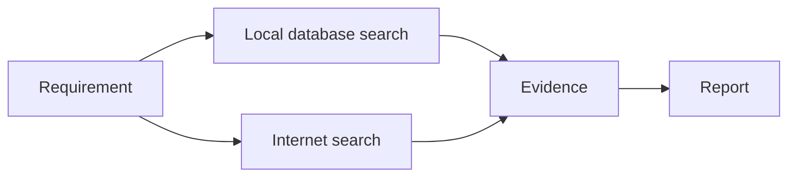

# Markdown Migration Studio

A local, review-first web application for migrating Markdown document libraries into a new template with an Ollama LLM.

Live server deployment: <http://192.168.1.249:5074>

## Run

```bash
python3 -m pip install -r requirements.txt
python3 app.py
```

Open <http://localhost:5000>. The default Ollama endpoint is `http://192.168.1.249:11434` and can be changed in Settings.

## Workflow

1. Enter the source, template, and output folder paths and scan.
2. Upload optional Markdown/text/JSON/YAML knowledge files.
3. Generate one draft or all drafts. Each source file is analyzed and rewritten in separate LLM passes by default.
4. Compare rendered before/after documents, inspect warnings and a raw diff, edit the draft, then approve it.
5. After verifying results, **Continue all + approve** processes and writes the remainder automatically.
6. Use **Download outputs ZIP** to download the output folder as-is, or **Download DOCX ZIP** for Word copies of all Markdown outputs.

The main migration instructions are editable in Settings. Project-specific session instructions can be entered directly or added conversationally through the assistant; they are included in both analysis and rewriting when drafts are regenerated.

Original files are never modified. Approved documents are written beneath the output folder. Existing output files are copied into timestamped `data/backups/` folders before replacement. The full activity record is available in the interface, `data/state.json`, and `data/template_changer.log`.

## Mermaid to editable PowerPoint

Markdown Migration Studio can now turn Mermaid diagrams into native editable PowerPoint shapes using `diagram-pptx` and `python-pptx`.

Mermaid can be embedded in migrated Markdown with a normal fenced block:

````markdown
## Procurement flow


````

Export a Markdown file containing one or more Mermaid blocks:

```bash
python3 export_mermaid_pptx.py data/workspace/output/report.md
```

Or export raw Mermaid directly:

```bash
python3 export_mermaid_pptx.py diagrams/process.mmd diagrams/process.pptx
```

Each Mermaid block becomes its own 16:9 PowerPoint slide. The diagram is emitted as editable PowerPoint objects rather than a screenshot. The reusable Python function is `document_conversion.markdown_mermaid_to_pptx()`.

`diagram-pptx` provides pure-Python native rendering for flowchart, sequence, class, ER and state diagrams. Other Mermaid families can require the Mermaid CLI/Official backend if they are used.

## Notes

- The app reads `.md` source files recursively.
- The upload panel accepts multiple files or a complete folder and safely preserves relative subfolders in the server workspace.
- Source and template uploads accept `.docx`; Word headings, lists, paragraphs, and tables are converted into a same-named `.md` file automatically.
- Set `MIGRATION_WORKSPACE` to select the server upload location. The deployment uses `/home/zageabb/markdown-migration-files`.
- Template and knowledge context supports `.md`, `.txt`, `.json`, `.yaml`, and `.yml`.
- LLM output paths are constrained beneath the configured output directory.
- For large libraries, keep templates focused and use concise knowledge files; context limits are editable in Settings.
